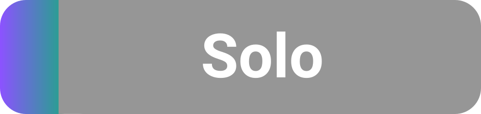

# Hexgrid Library
 

This code implements functions relating to a Hexagonal Coordinate System and Grid. It includes functions for cube, axial and oddr coordiantes. Massive credit to [Red Blob Games](https://www.redblobgames.com/grids/hexagons/) for many of the algorithms used in this library, that I translated into GDScript for use in my upcoming game.

<p align="center">
  

## Prerequisites

GDScript for Godot 4, haven't tested previous versions compatability.

## Install

Copy the hex.gd file into a folder called Hexgrid in your project directory and then in script you can instantiate it with:

```

const HEXGRID = preload("res://Hexgrid/hex.gd")
var HEX = HEXGRID.new()

```

To use any function from the library do so from the HEX variable, such as:

```

var oddr_coord = Vector2i(1,2)
var axial_coord = HEX.oddr_to_axial(oddr_coord)

```

## Usage

The library has functions relating to converting oddr grid coordiantes into cube / axial, creating spirals of hexagonal tiles, calculating the distance between hexes, finding the neighbouring tiles amongst other things. For a complete understanding I definitely recommend a read of the Red Blob Games blog post but the code comments should get you most of the way there.

## License

[MIT](https://choosealicense.com/licenses/mit/)
